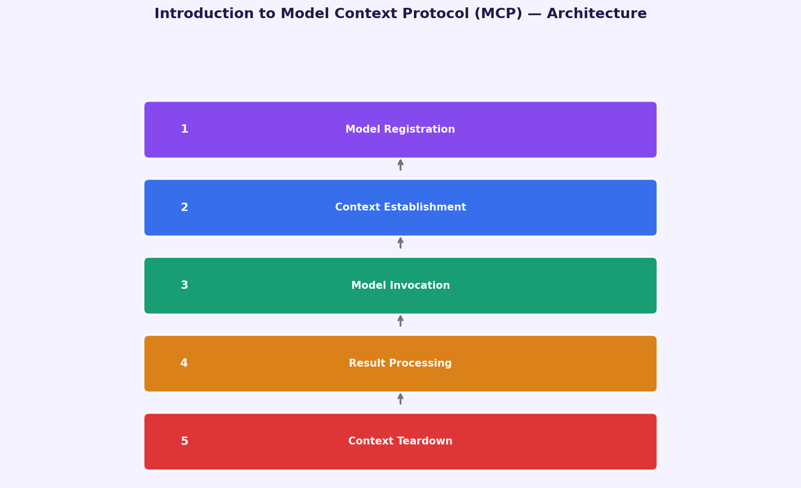
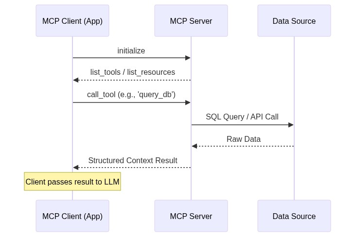

# What is MCP and why does it matter?

**Status:** Draft (Pending approval)
**Series:** `mcp-deep-dive` | **Part:** 1/5 | **Date:** 2026-04-07
**Finalized Topic:** Introduction to Model Context Protocol (MCP)

---

As engineers, we're often faced with the challenge of integrating AI models with various data sources. This can lead to a complex web of bespoke connectors, making it difficult to manage and scale our systems. The Model Context Protocol (MCP) aims to simplify this process by providing a universal interface for AI-data integration.

Here are four key points to consider:
1. MCP was launched by Anthropic as an open-standard protocol, reducing integration complexity from O(N*M) to O(N+M) standardized interfaces.
2. The protocol is built on the JSON-RPC 2.0 specification, ensuring language-agnostic communication between clients and servers.
3. MCP supports three core primitives: Resources, Tools, and Prompts, which can be used to expose data, execute functions, and provide reusable templates.
4. The protocol uses transport layers such as STDIO and HTTP with Server-Sent Events (SSE) for local and remote connections, respectively.

From a technical perspective, MCP operates via a persistent session between an MCP Client and an MCP Server. The protocol utilizes a capability negotiation phase, where the server manifests its available Resources and Tools to the client. This decoupling allows the AI model to dynamically discover and invoke capabilities during runtime, abstracting away the underlying authentication and data fetching logic.

A practical takeaway from this introduction to MCP is that it can simplify the integration of AI models with data sources, making it easier to manage and scale our systems. By using MCP, we can define a standardized interface for our AI applications, making it easier to switch between different data providers or tools.

In the next part of this series, we will explore real-world implementations of MCP, including its use in building advanced autonomous agents and intelligent developer tools.

---

[▶ Listen](assets/narration.mp3)
