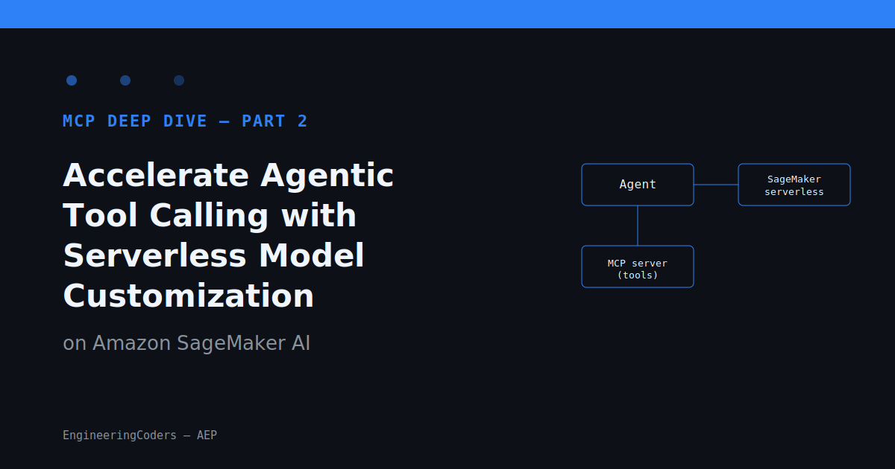
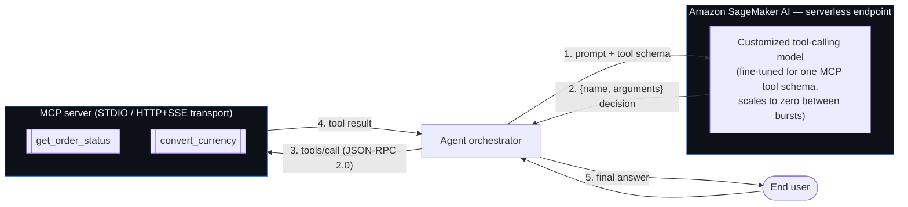
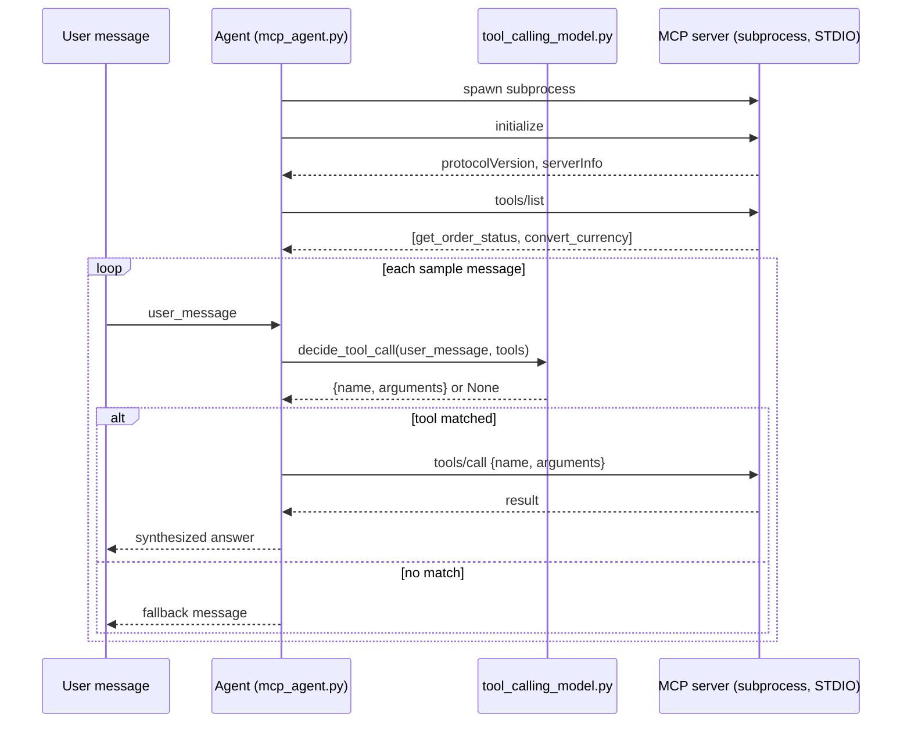

# Accelerate Agentic Tool Calling with Serverless Model Customization in Amazon SageMaker AI



**Series:** `mcp-deep-dive` | **Part:** 2 — MCP in Action: Real-World Applications and Case Studies
**Status:** Draft — Pending Human Approval

---

## Problem statement

[Part 1](../part-01/article_draft.md) covered what MCP is: a JSON-RPC 2.0
protocol that lets an AI application discover and call a server's Resources,
Tools, and Prompts without a bespoke integration per data source. That
solves the *interface* problem — but it creates a new one once you're
running an agent in production: **something still has to decide which tool
to call, with which arguments, on every turn.** That decision is itself a
model inference call, and it happens far more often than the "final answer"
call — a single user request can trigger several rounds of tool selection
before the agent has enough information to respond.

Two ways teams commonly get this wrong:

- **Route every tool-selection decision through a large general-purpose
  foundation model.** It works, but you pay full frontier-model latency and
  cost for what is often a narrow, repetitive decision — "does this message
  match `get_order_status` or `convert_currency`, and what are the
  arguments?"
- **Fine-tune a small model on your own tool schema and host it on a
  dedicated, always-on GPU instance.** Cheaper and faster per call, but now
  you're paying for idle GPU capacity between the bursts of tool-calling
  traffic that agent workloads actually produce.

## Why now

This is the practical, applied half of the series' promise — see the series
plan's part 2 title, "MCP in Action: Real-World Applications and Case
Studies" (`series_plan.json` under `part-01/`). AWS's own write-up on
accelerating agentic tool calling with serverless model customization in
Amazon SageMaker AI is the trend signal here: it describes hosting a
customized, tool-calling-specific model behind a serverless/on-demand
SageMaker AI endpoint, so the tool-selection step scales with actual agent
traffic instead of running a dedicated instance around the clock (AWS
Machine Learning Blog). Amazon SageMaker AI is AWS's managed platform for
building, training, fine-tuning, and hosting models, including inference
options built to scale down between bursts (`aws.amazon.com/sagemaker/ai`).

## Architecture

The pattern has three moving parts: the agent orchestrator, a *customized*
tool-calling model hosted serverlessly, and one or more MCP servers that
actually execute the tools once a decision is made. The MCP server never
needs to know anything about the model — it only ever sees a standard
`tools/call` JSON-RPC request.



(Source: [`assets/diagrams/architecture.mmd`](assets/diagrams/architecture.mmd).)

Two things worth calling out about this split:

1. **The model is disposable and swappable.** Because the MCP server only
   ever receives a standard `tools/call` message, you can retrain, resize, or
   swap the customized model without touching the tool server at all — the
   contract between them is the MCP tool schema, not the model's weights.
2. **Serverless is a cost/latency trade against a narrower model, not a free
   lunch.** A customized SageMaker AI endpoint that scales to zero will have
   a cold-start penalty on the first call after idle time — you're trading
   dedicated-GPU idle cost for occasional first-call latency. Whether that
   trade is worth it depends on how bursty your agent traffic actually is.

## Build walkthrough

The `project/` folder in this article is a runnable, offline demonstration
of steps 1–4 above using the real MCP wire format. It intentionally does
**not** call a live SageMaker endpoint (that needs an AWS account, an IAM
role, and billable GPU/Inferentia capacity, none of which exist in this
repo's CI sandbox) — instead, `tool_calling_model.py` is an explicitly
labeled, deterministic stand-in for that hosted model's decision step, so
the rest of the code is exactly what it would be against a real endpoint.

Runtime flow for each sample message, end to end:



(Source: [`assets/diagrams/sequence.mmd`](assets/diagrams/sequence.mmd).)
The handshake (`initialize`/`tools/list`) happens once per process; the
decide→call→answer loop repeats per message. Now the code for each step:

```python
# project/tool_calling_model.py
def decide_tool_call(user_message: str, tools: list) -> dict | None:
    """Return {'name': ..., 'arguments': {...}} or None if no tool applies.

    A real customized model picks this from the schemas in `tools` via a
    learned forward pass; this rule-based version picks it via regex so the
    demo has no model-weights dependency.
    """
    tool_names = {t["name"] for t in tools}

    order_match = re.search(r"\border\s+([A-Za-z0-9]+)", user_message, re.IGNORECASE)
    if order_match and "get_order_status" in tool_names:
        return {"name": "get_order_status", "arguments": {"order_id": order_match.group(1).upper()}}
    ...
```

The MCP server side is a direct implementation of the STDIO transport:
newline-delimited JSON-RPC 2.0 messages on stdin/stdout, with `initialize`,
`tools/list`, and `tools/call` handlers:

```python
# project/mcp_tools_server.py
def _handle(message: dict) -> dict:
    method = message.get("method")
    msg_id = message.get("id")
    if method == "initialize":
        result = {"protocolVersion": "2025-11-25", "serverInfo": {"name": "support-tools", "version": "0.1.0"}}
    elif method == "tools/list":
        result = {"tools": TOOLS}
    elif method == "tools/call":
        params = message.get("params", {})
        result = _call_tool(params["name"], params.get("arguments", {}))
    else:
        return {"jsonrpc": "2.0", "id": msg_id, "error": {"code": -32601, "message": f"method not found: {method}"}}
    return {"jsonrpc": "2.0", "id": msg_id, "result": result}
```

And the agent loop that ties them together spawns the server as a
subprocess and drives the JSON-RPC exchange over its stdin/stdout pipes:

```python
# project/mcp_agent.py (excerpt)
def request(self, method: str, params: dict | None = None) -> dict:
    msg_id = self._next_id
    self._next_id += 1
    message = {"jsonrpc": "2.0", "id": msg_id, "method": method, "params": params or {}}
    self.proc.stdin.write(json.dumps(message) + "\n")
    self.proc.stdin.flush()
    line = self.proc.stdout.readline()
    return json.loads(line)
```

## Mini-project

`project/` is the full runnable code above, wired together — see
[`project/README.md`](project/README.md) for the exact commands
(`python3 mcp_agent.py`, standard library only, no dependencies to install).
It runs three sample user messages through the loop: one that resolves to
`get_order_status`, one that resolves to `convert_currency`, and one with no
matching tool (to show the fallback path).

**Execution status: verified.** This draft was originally authored in a
sandboxed session where all local command execution was blocked with `This
command requires approval`, with no interactive user available to grant it —
the code was traced line-by-line but not run, and that gap was disclosed
rather than papered over with a fabricated transcript. A follow-up review,
outside that sandbox, ran it for real (`python3 project/mcp_agent.py`,
`exit_code=0`) and confirmed the output matches what this walkthrough
claims — see `project/README.md`'s Execution status section for the full
transcript and `project/evidence/run-mcp_agent.log` for the raw log.
`project/build-artifact.json`'s `build_status` now reflects that real run,
per this repo's constitution — "never publish unexecuted code"
(`aep/README.md`).

## Trade-offs

- **Cold starts are real.** Serverless SageMaker AI endpoints that scale to
  zero add latency on the first invocation after an idle period — fine for
  bursty internal tools, potentially not for a user-facing agent with a
  tight latency SLO on every turn.
- **A model customized for one tool schema generalizes worse than a large
  foundation model.** If your agent needs to pick up new tools frequently,
  the retraining/redeployment loop for the customized model becomes part of
  your operational surface area — a cost this pattern trades against per-call
  savings, not something it eliminates.
- **The mock decision function in this project is not the real thing.** A
  regex stand-in demonstrates the JSON-RPC mechanics correctly, but says
  nothing about the accuracy trade-offs of an actual fine-tuned model —
  don't over-read the demo as a benchmark.
- **MCP tool execution is a trust boundary.** Because the tool-calling model
  only returns a name and arguments, whatever executes `tools/call` (the MCP
  server) must independently validate inputs — never assume the model's
  output is already safe to run against production systems.
- **This PR is a draft, not a publish.** Per `aep/README.md`'s constitution
  ("human approval before publication"), this issue only authorizes opening
  a draft PR — merging and any Notion sync still needs explicit human
  sign-off.

## References

- Anthropic, ["Introducing the Model Context Protocol"](https://www.anthropic.com/news/model-context-protocol)
- [Model Context Protocol — Introduction](https://modelcontextprotocol.io/introduction)
- [modelcontextprotocol on GitHub](https://github.com/modelcontextprotocol)
- AWS Machine Learning Blog, ["Accelerate agentic tool calling with serverless model customization in Amazon SageMaker AI"](https://aws.amazon.com/blogs/machine-learning/accelerate-agentic-tool-calling-with-serverless-model-customization-in-amazon-sagemaker-ai/)
- [Amazon SageMaker AI](https://aws.amazon.com/sagemaker/ai/)
- Hugging Face, ["Introducing Gradio's MCP Server"](https://huggingface.co/blog/introducing-gradio-server)
