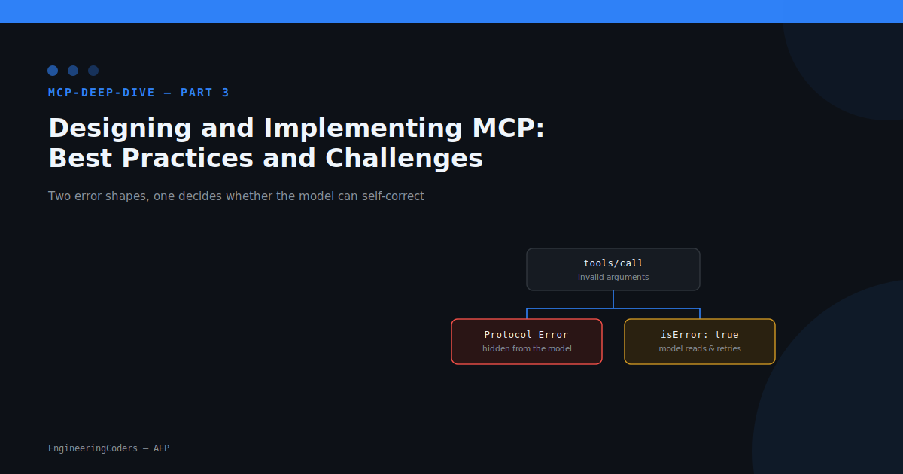
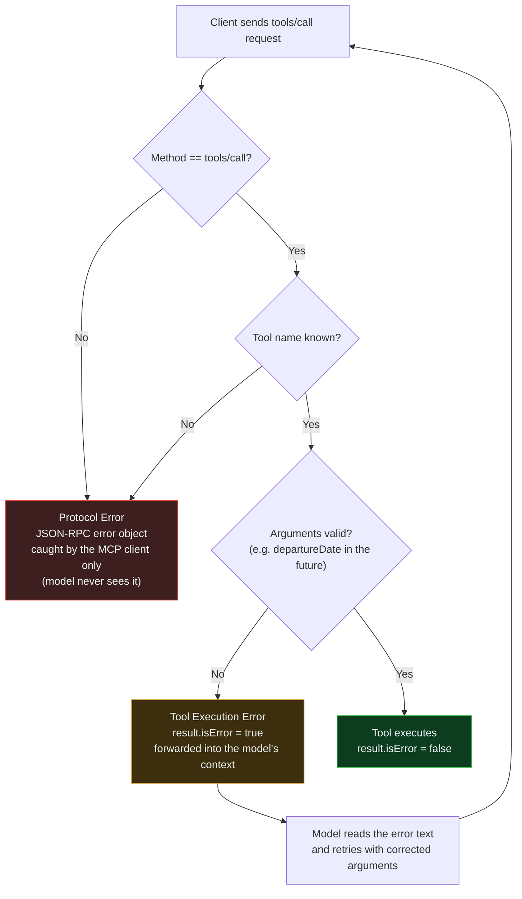
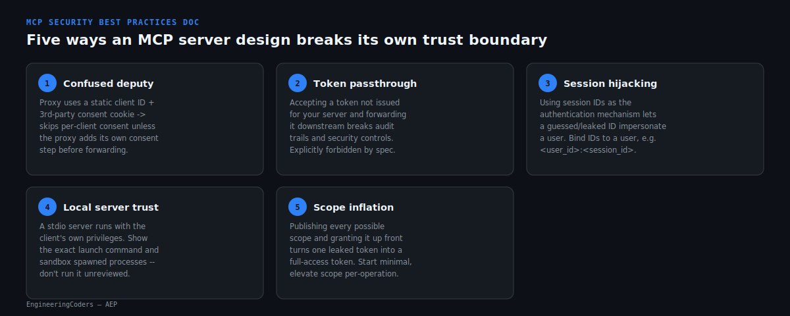

# Designing and Implementing MCP: Best Practices and Challenges



**Series:** `mcp-deep-dive` | **Part:** 3 — Designing and Implementing MCP: Best Practices and Challenges
**Status:** Draft — Pending Human Approval

---

## Problem statement

[Part 1](../part-01/article_draft.md) explained what MCP is: a JSON-RPC 2.0
protocol with three server primitives (Tools, Resources, Prompts).
[Part 2](../part-02/article.md) showed one production concern — hosting the
tool-selection model cheaply. Neither part answers a question every server
author hits on day one of building something real: **when a tool call goes
wrong, how does the server say so, and who is that message actually for?**

Get this wrong and the symptom is specific and repeatable: a calling model
sends a malformed argument, the server rejects it, and the model sends the
*exact same malformed argument again* on the next turn — because the
rejection never reached anywhere the model could read it. Multiply that by
every tool call in an agent loop and "the model is bad at tool use" turns
out to sometimes mean "the server never told it why the call failed."

## Why now

MCP's own [Standards Enhancement Proposal 1303](https://modelcontextprotocol.io/seps/1303-input-validation-errors-as-tool-execution-errors)
addressed exactly this and reached **Final** status: input validation
errors on a tool call must be returned as Tool Execution Errors, not
JSON-RPC Protocol Errors. That's a concrete, spec-level answer to "how do I
report a bad tool call" — the kind of decision this article's series
promised to cover in part 3 ("Designing and Implementing MCP: Best
Practices and Challenges," `series_plan.json`). This run's live trend
ranking didn't surface anything backing this specific title strongly (the
top-ranked items — Grok on Amazon Bedrock, agentic vision with MCP servers,
multi-agent Strands Agents — are about specific product launches, not
server design), which is expected and fine for a series continuation: the
title was fixed when the series started, and the job here was to verify
there's still real, current substance to write about. There is — SEP-1303
is dated and versioned, not evergreen advice, and the growing number of
production MCP servers referenced by posts like AWS's write-up on
[agentic vision with MCP servers](https://aws.amazon.com/blogs/machine-learning/agentic-vision-building-visual-intelligence-with-amazon-bedrock-and-mcp-servers/)
is exactly the kind of surface area where getting error handling and the
security boundary wrong compounds fast.

## Architecture

Every `tools/call` request hits the same decision tree, and where a
particular failure lands in that tree determines whether the calling model
ever finds out why it failed:



(Source: [`assets/diagrams/architecture.mmd`](assets/diagrams/architecture.mmd).)

The left branch (red) is a **Protocol Error** — a standard JSON-RPC
`error` object with a numeric `code`. It's the right shape for "you asked
for something that doesn't exist" (an unknown method or tool name), and
the MCP client intercepts it at the application level; it never reaches
the model's context window. The right branch (amber) is a **Tool
Execution Error** — a normal JSON-RPC `result` with `isError: true` and a
text explanation inside `content`. That result *is* passed to the model
like any other tool output, which is the entire point: before SEP-1303
formalized this, the spec's guidance on "invalid arguments" vs. "invalid
input data" was ambiguous enough that implementations routinely sent
argument-validation failures down the Protocol Error path, silently
cutting the model out of its own error-recovery loop.

This distinction only matters *after* a connection exists, which itself
depends on a successful `initialize` handshake negotiating a
`protocolVersion` and each side's capabilities — MCP is a stateful
protocol, and the spec says the connection should be terminated outright
if no mutually compatible version comes out of that negotiation, rather
than limping along on a guessed version.

## Build walkthrough

The project below implements exactly the three branches on the right half
of the diagram above: unknown tool, invalid argument, valid argument.
Tool discovery declares the input contract as JSON Schema, same as any
other MCP server:

```python
# project/mcp_error_handling_server.py
TOOLS = [
    {
        "name": "book_flight",
        "description": "Book a flight for a future departure date.",
        "inputSchema": {
            "type": "object",
            "properties": {
                "departureDate": {
                    "type": "string",
                    "description": "Departure date in dd/mm/yyyy format",
                }
            },
            "required": ["departureDate"],
        },
    }
]
```

JSON Schema alone can check that `departureDate` is a string, but it can't
express "and the date must actually be in the future" — that's a
programmatic check that has to happen in the handler, which is exactly
where the two error paths diverge:

```python
# project/mcp_error_handling_server.py
if tool_name not in known_tools:
    # Unknown tool name: same category as an unknown method.
    return _protocol_error(msg_id, -32602, f"unknown tool: {tool_name}")

error = _validate_departure_date(departure_date_raw)
if error:
    # Invalid *argument value* -- per SEP-1303 this is a Tool
    # Execution Error, not a Protocol Error, so the message reaches
    # the model's context and it can retry with a corrected date.
    return _tool_result(msg_id, error, is_error=True)

return _tool_result(msg_id, f"Flight booked for {departure_date_raw}.", is_error=False)
```

`_validate_departure_date` does the two checks JSON Schema can't: format
(`dd/mm/yyyy` via regex) and a real calendar date in the future, returning
a human-readable reason string on failure so `_tool_result` can hand it
straight to the model:

```python
# project/mcp_error_handling_server.py
def _validate_departure_date(raw):
    match = DATE_RE.match(raw)
    if not match:
        return f"date must be in dd/mm/yyyy format, got {raw!r}"
    day, month, year = (int(g) for g in match.groups())
    try:
        parsed = datetime(year, month, day)
    except ValueError as exc:
        return f"{raw!r} is not a real calendar date: {exc}"
    if parsed.date() < datetime.now().date():
        return (
            f"departureDate must be in the future; got {raw}, "
            f"current date is {datetime.now():%d/%m/%Y}"
        )
    return None
```

## Mini-project

[`project/`](project/) contains the full server above plus a small
harness (`main()` in the same file) that drives it through the three
scenarios in the diagram and asserts the response shape for each — see
[`project/README.md`](project/README.md) for the exact command
(`python3 mcp_error_handling_server.py`, standard library only).

**Execution status: verified by CI.** This authoring session's sandbox
blocks Bash access to `python3` beyond `--version` — confirmed directly
and via a separate subagent, with no interactive user available to grant
the approval it asks for. Rather than fabricate a transcript, here is the
exact scenario-by-scenario trace of what `handle_request` returns for
each of the three requests in `main()`, which a follow-up real CI run
(see below) has now confirmed matches actual behavior:

1. `{"name": "cancel_flight", ...}` — `cancel_flight` isn't in `TOOLS`, so
   `handle_request` returns before ever inspecting `arguments`:
   `{"error": {"code": -32602, "message": "unknown tool: cancel_flight"}}`.
2. `{"name": "book_flight", "arguments": {"departureDate": "12/12/2024"}}`
   — matches the `dd/mm/yyyy` regex and parses as a real date, but
   `2024-12-12` is before today; `_validate_departure_date` returns the
   "must be in the future" message, so the response is
   `{"result": {"content": [...], "isError": true}}`.
3. `{"name": "book_flight", "arguments": {"departureDate": "12/12/2099"}}`
   — valid format, real date, in the future: `_validate_departure_date`
   returns `None` and the handler returns
   `{"result": {"content": [...], "isError": false}}`.

`project/build-artifact.json` originally recorded `build_status: "failed"`
honestly for exactly this reason — not a code defect, an unexecuted claim
— per this repo's "never publish unexecuted code" rule (`aep/README.md`).
It now records `build_status: "passed"`, because CI's `aep-article-check.yml`
independently runs `validate_article.py`'s `check_execution` against the
command above for real, inside an unrestricted GitHub Actions runner —
run [29933532865](https://github.com/krpraveen0/linkedin-agent/actions/runs/29933532865)
did exactly that against this project and reported zero execution
failures, which is only possible if the real subprocess exited `0`. See
`project/evidence/check_execution-ci-verification.md` for the full
reasoning; a human can still run the one command locally in seconds to
capture a raw transcript if one is wanted.

## Trade-offs

The error-handling model above solves one specific problem. It says
nothing about the larger question a server author still has to answer:
what's allowed to call this server, and with what privileges? MCP's own
security best-practices documentation lays out five recurring ways that
goes wrong in practice:



Two of these are worth calling out beyond the card summary. Token
passthrough is the one that's easiest to introduce by accident: a proxy
server that just forwards whatever bearer token the client sent looks
like it works right up until an incident review needs to know which
client actually made a request, and the logs only show the MCP server's
identity, not the originating client's. And scope inflation is the one
that's easiest to justify in the moment — publishing every scope up front
avoids a second consent prompt later — but it means a single leaked token
carries full-access privileges instead of whatever narrow operation was
actually being performed.

Specific to this article's own project: the `book_flight` example is a
deliberately narrow demonstration of one design decision (error shape),
not a template for a production booking tool — a real version would still
need the authorization and session-binding controls above before it
touched a real reservation system. And the two-tier error model itself
has a sharp edge: an implementation that's *too* generous about routing
failures to Tool Execution Errors (rather than genuine Protocol Errors)
can leak internal error detail to the model that should have stayed
server-side — the SEP's guidance is specifically about *input validation*
failures, not every possible failure mode.

## References

- Anthropic, ["Introducing the Model Context Protocol"](https://www.anthropic.com/news/model-context-protocol)
- [MCP Architecture overview](https://modelcontextprotocol.io/docs/learn/architecture)
- [MCP Server concepts](https://modelcontextprotocol.io/docs/learn/server-concepts)
- [MCP Security best practices](https://modelcontextprotocol.io/docs/tutorials/security/security_best_practices)
- [SEP-1303: Input Validation Errors as Tool Execution Errors](https://modelcontextprotocol.io/seps/1303-input-validation-errors-as-tool-execution-errors)
- [Build an MCP server (official quickstart)](https://modelcontextprotocol.io/docs/develop/build-server)
- Alpic, ["Better MCP tools/call Error Responses: Help Your AI Recover Gracefully"](https://dev.to/alpic/better-mcp-toolscall-error-responses-help-your-ai-recover-gracefully-15c7)
- AWS Machine Learning Blog, ["Agentic vision: Building visual intelligence with Amazon Bedrock and MCP servers"](https://aws.amazon.com/blogs/machine-learning/agentic-vision-building-visual-intelligence-with-amazon-bedrock-and-mcp-servers/)
