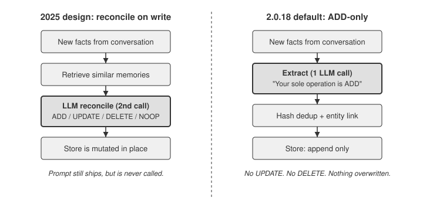
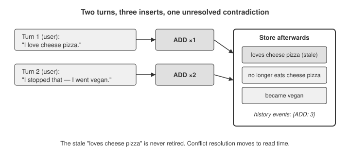

# I Told My Mem0 Agent I Went Vegan. It Kept the Memory That I Love Cheese Pizza.

I gave a [Mem0](https://github.com/mem0ai/mem0) agent two facts, one turn apart. First: "I absolutely love cheese pizza." Then: "Actually I stopped eating cheese pizza, I went vegan." I expected the second statement to overwrite or retire the first. That is what Mem0 was famous for. Instead, when I read the store back, both were sitting there side by side, and the history log said every event was an `ADD`. Nothing was updated. Nothing was deleted.

This is not a bug. It is the current design. The version I ran, `mem0ai` 2.0.18, was [published to PyPI on August 11, 2026](https://pypi.org/project/mem0ai/), two days before I wrote this. Somewhere between the paper that made Mem0 famous and the package you `pip install` today, the memory-reconciliation step quietly disappeared. If you are storing user preferences in Mem0 and expecting it to keep them current, you need to know that it no longer does that on its own.

## The design that made Mem0 famous

Mem0's [2025 research paper](https://arxiv.org/abs/2504.19413), "Mem0: Building Production-Ready AI Agents with Scalable Long-Term Memory," introduced an architecture that dynamically extracts and consolidates facts from a conversation instead of dumping raw turns into a vector store. That consolidation step, deciding what to do with each new fact relative to what is already stored, is spelled out in a prompt that still ships in the package today.

That decision step is still in the package. It lives in `mem0/configs/prompts.py` as `DEFAULT_UPDATE_MEMORY_PROMPT`, and it opens like this:

> You are a smart memory manager which controls the memory of a system. You can perform four operations: (1) add into the memory, (2) update the memory, (3) delete from the memory, and (4) no change.

Those four operations, usually written `ADD` / `UPDATE` / `DELETE` / `NOOP`, are the mechanism behind every "Mem0 keeps your agent's memory consistent" tutorial. Tell the agent you love cheese pizza, then tell it you went vegan, and the reconciler is supposed to fire an `UPDATE` or a `DELETE` so the stale preference does not linger.

The prompt is right there in the installed source. The catch is what calls it.

## What 2.0.18 actually does

Nothing calls it.

The project's README documents a new memory algorithm dated April 2026, and the headline bullet is blunt:

> Single-pass ADD-only extraction — one LLM call, no UPDATE/DELETE. Memories accumulate; nothing is overwritten.

The default `add()` path now makes a single LLM call using a different prompt, `ADDITIVE_EXTRACTION_PROMPT`, whose role description states its purpose in one sentence: "Your sole operation is ADD." There is no second reconciliation call. The pipeline extracts facts, deduplicates them against existing memories by an exact MD5 hash of the text, embeds them, links entities across memories, and inserts. A fact that is not a byte-for-byte duplicate gets stored, full stop.

The other April 2026 changes point the same direction. The README lists "Entity linking — entities are extracted, embedded, and linked across memories for retrieval boosting," and "Temporal Reasoning — time-aware retrieval that ranks the right dated instance for queries about current state, past events, and upcoming plans." Mem0 no longer tries to make the store internally consistent at write time. It keeps everything and leans on retrieval to surface the right version at read time.



*Figure 1 — The reconciliation step from the 2025 design (left) is gone. The 2.0.18 default `add()` pipeline (right) makes one LLM call and only ever inserts.*

## Proof from the installed package

You do not have to take my word or the README's. The package will tell you which prompt the pipeline imports. This script does pure source inspection, no LLM calls and no network:

```python
import inspect
import mem0
from mem0.memory import main as memory_main
from mem0.configs import prompts

print("mem0 version:", mem0.__version__)
src = inspect.getsource(memory_main)
print("main.py imports ADDITIVE_EXTRACTION_PROMPT:", "ADDITIVE_EXTRACTION_PROMPT" in src)
print("main.py references DEFAULT_UPDATE_MEMORY_PROMPT:", "DEFAULT_UPDATE_MEMORY_PROMPT" in src)
print("main.py references get_update_memory_messages:", "get_update_memory_messages" in src)
print("DEFAULT_UPDATE_MEMORY_PROMPT still defined in prompts.py:",
      hasattr(prompts, "DEFAULT_UPDATE_MEMORY_PROMPT"))
```

Real output:

```
mem0 version: 2.0.18
main.py imports ADDITIVE_EXTRACTION_PROMPT: True
main.py references DEFAULT_UPDATE_MEMORY_PROMPT: False
main.py references get_update_memory_messages: False
DEFAULT_UPDATE_MEMORY_PROMPT still defined in prompts.py: True
```

The reconciler prompt ships in the package but the pipeline module never imports it or the helper that builds its messages. It is dead code on the default path.

## Try it yourself

Now watch the behavior end to end. The script below runs Mem0's real `add()` pipeline. Only the LLM and the embedder are stubbed, so it needs no API key and no network and is fully deterministic. Everything that matters here — retrieval of the existing memory, the decision of what to do with a contradicting fact, and storage — is Mem0's own code. The stub LLM just returns the facts a real extractor would pull out of each turn.

```python
USER = "alex"

# Turn 1: a clear preference.
m.llm.enqueue({"memory": [{"text": "User loves cheese pizza"}]})
r1 = m.add("I absolutely love cheese pizza.", user_id=USER)
print("add #1 events:", [(e["memory"], e["event"]) for e in r1["results"]])

# Turn 2: the user directly contradicts turn 1 and adds a new fact.
m.llm.enqueue({"memory": [
    {"text": "User no longer eats cheese pizza"},
    {"text": "User became vegan"},
]})
r2 = m.add("Actually I stopped eating cheese pizza — I went vegan.", user_id=USER)
print("add #2 events:", [(e["memory"], e["event"]) for e in r2["results"]])

all_mem = m.get_all(filters={"user_id": USER})["results"]
print("\nStored memories after the contradiction (sorted):")
for mem in sorted(all_mem, key=lambda x: x["memory"]):
    print("  -", mem["memory"])
```

Real captured output:

```
add #1 events: [('User loves cheese pizza', 'ADD')]
add #2 events: [('User no longer eats cheese pizza', 'ADD'), ('User became vegan', 'ADD')]

Stored memories after the contradiction (sorted):
  - User became vegan
  - User loves cheese pizza
  - User no longer eats cheese pizza

History event types across all memories: {'ADD': 3}
```

The store now holds "User loves cheese pizza" and "User no longer eats cheese pizza" at the same time. The contradiction was not resolved. The history event counter reads `{'ADD': 3}`: three inserts, zero updates, zero deletes. The full runnable script, including the stub LLM and embedder and the local Qdrant setup, is in the repository linked at the end.

The only thing standing between you and unbounded growth is deduplication, and it is narrow. In the pipeline, `mem_hash = hashlib.md5(text.encode()).hexdigest()` and a new fact is skipped only when that exact hash already exists. It is an exact-string match on the extracted text, not a semantic one. "User loves cheese pizza" and "User no longer eats cheese pizza" hash differently, so both survive. Even two phrasings of the same retraction would both land if the extractor worded them differently on different turns.



*Figure 2 — Two turns, three inserts. The stale preference is never retired; both the old and new facts coexist in the store.*

## Why this matters for your agent

Accumulation over revision is a defensible trade. Overwriting a memory is destructive and hard to undo, and an `UPDATE`/`DELETE` decision made by an LLM at write time can be wrong in ways you never see. Keeping every fact and sorting it out at read time, using the new temporal reasoning and multi-signal retrieval, keeps an audit trail and lets recency win where it should. Mem0's own framing in the README is that memories accumulate and nothing is overwritten.

The trap is assuming the old behavior is still there. If your application reads back "the user's dietary preference" with a naive top-k semantic search, both the vegan fact and the cheese-pizza fact are candidates, and there is no write-time guarantee that the newer one wins. Conflict resolution is now your job, whether through Mem0's temporal-aware retrieval, your own recency filtering, or explicit cleanup.

And explicit cleanup is still available. The automatic reconciliation is what went away, not the ability to change the store. Mem0 still exposes `update(memory_id, data)`, `delete(memory_id)`, and `delete_all(user_id=...)` for you to call directly. If a user retracts a preference and you need the old one gone, you have to issue that `delete` yourself. The library will not infer it from the next thing they say.

## Key Takeaways

- As of `mem0ai` 2.0.18 (published August 11, 2026), the default `add()` pipeline is single-pass and ADD-only. It does not automatically `UPDATE` or `DELETE` existing memories.
- The classic four-operation reconciler prompt (`DEFAULT_UPDATE_MEMORY_PROMPT`) still ships in the package but nothing on the default path imports or calls it.
- Feeding Mem0 a fact and then its contradiction leaves both in the store. Verified: three `add` inputs produced `{'ADD': 3}` history events and three coexisting memories, including the contradiction.
- Conflict resolution moved from write time to read time. Plan for it in retrieval, or manage it explicitly with `update()` / `delete()`.
- If you rely on tutorials or the 2025 paper for Mem0's write-time behavior, re-check against the package you actually installed.

## Sources

- Mem0 GitHub repository and README (new memory algorithm, April 2026): https://github.com/mem0ai/mem0
- `mem0ai` on PyPI (version 2.0.18, published 2026-08-11): https://pypi.org/project/mem0ai/
- Mem0 research paper, "Mem0: Building Production-Ready AI Agents with Scalable Long-Term Memory" (arXiv:2504.19413, 2025): https://arxiv.org/abs/2504.19413
- Direct inspection of the installed `mem0` 2.0.18 package (`memory/main.py`, `configs/prompts.py`) and runnable code, executed and captured for this article.
