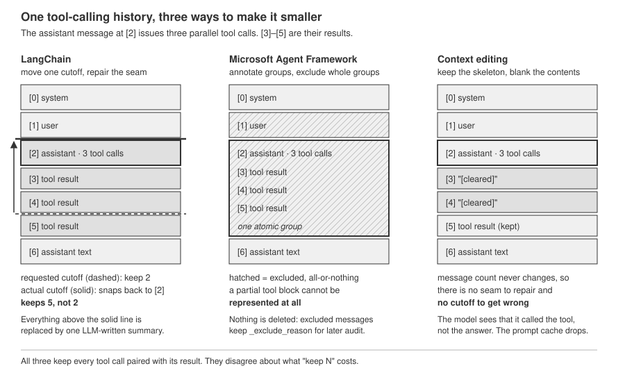
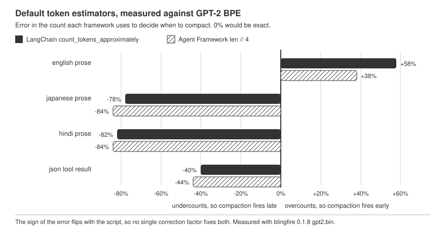

# I Asked LangChain to Keep the Last 6 Messages. It Kept 9. Here's the Invariant That Forced It.

Between 21 July and 14 August 2026, Microsoft's Agent Framework shipped four Python releases. Buried in the "Fixed" sections of three of them is a cluster of entries that all point at the same subsystem:

- `python-1.12.0` (21 July): "Count non-ASCII text correctly during compaction" (#7124), "Prevent compaction from emitting empty projections" (#7219)
- `python-1.13.0` (30 July): "Keep function-call and result occurrences atomic during compaction" (#7406)
- `python-1.14.0` (14 August): "Ignore excluded tool results during compaction" (#7391), "Bound tool-result compaction summaries before provider calls" (#7396)

Five bugs, three weeks, one component. That is not the signature of a feature nobody uses. It is the signature of a component that is load-bearing, subtle, and harder than it looks.

Context compaction is what happens when your agent's conversation history grows past what you are willing to send to the model, and something has to decide what gets thrown away. Every serious agent framework now ships one. LangChain has `SummarizationMiddleware` and `ContextEditingMiddleware`. Microsoft Agent Framework has a `CompactionProvider` with seven strategies. The OpenAI Agents SDK has `OpenAIResponsesCompactionSession`. Anthropic implements it server-side as a context-editing beta.

They all solve the same problem, and they all obey the same unwritten invariant. That invariant is the reason "keep the last 6 messages" does not mean what you think it means.

One failure mode here is already well covered: summaries quietly dropping standing instructions and safety policies, which is a question about what the summarizer *chooses* to keep. This is about the layer underneath that. Before any of it matters semantically, the mechanics of cutting a history have to produce a request the provider will accept at all, and the threshold that triggers the cut has to fire somewhere near where you set it. Both turn out to be less certain than the configuration surface suggests.

I installed all three Python frameworks, read the compaction source, and measured what they actually do. The short version: the guarantee is real and every framework honors it, but it is paid for in a currency nobody puts in the docs, and the trigger that decides when to pay is an estimate that can be off by a factor of five.

## The Invariant Nobody Writes Down

When a model calls a tool, the conversation acquires a structural dependency. The assistant message says "call `search_flights` with id `call_abc`". A following tool message says "here is the result for `call_abc`". Those two are not independent items in a list. They are a matched pair, and the provider APIs enforce it.

Drop the assistant message and keep the result, and you have an orphaned tool result: a message referencing a call ID that appears nowhere. Drop the result and keep the call, and you have a dangling tool call: the model asked for something and the transcript never answers. Both are 400-class errors on OpenAI and Anthropic. Neither is a soft degradation you can ignore.

This is why naive trimming breaks. `messages[-20:]` is a perfectly reasonable thing to write and a reliable way to produce an invalid request, because index -20 has no idea whether it landed in the middle of a tool exchange.

So every compactor has to answer one question: when the cutoff lands mid-pair, what gives? The three frameworks answer it three different ways, and the differences are architectural rather than cosmetic.

## Under the Hood: Three Designs for One Guarantee

### LangChain: repair the seam

LangChain's [`SummarizationMiddleware`](https://github.com/langchain-ai/langchain/blob/master/libs/langchain_v1/langchain/agents/middleware/summarization.py) (shipped in `langchain` 1.3.15, released to PyPI on 11 August 2026) works on a flat message list and a single integer cutoff. `messages[:cutoff]` gets summarized by an LLM call; `messages[cutoff:]` survives verbatim.

The whole invariant lives in one static method, `_find_safe_cutoff_point`:

```python
if cutoff_index >= len(messages) or not isinstance(messages[cutoff_index], ToolMessage):
    return cutoff_index

# Collect tool_call_ids from consecutive ToolMessages at/after cutoff
tool_call_ids: set[str] = set()
idx = cutoff_index
while idx < len(messages) and isinstance(messages[idx], ToolMessage):
    tool_msg = cast("ToolMessage", messages[idx])
    if tool_msg.tool_call_id:
        tool_call_ids.add(tool_msg.tool_call_id)
    idx += 1

# Search backward for AIMessage with matching tool_calls
for i in range(cutoff_index - 1, -1, -1):
    msg = messages[i]
    if isinstance(msg, AIMessage) and msg.tool_calls:
        ai_tool_call_ids = {tc.get("id") for tc in msg.tool_calls if tc.get("id")}
        if tool_call_ids & ai_tool_call_ids:
            # Found the AIMessage - move cutoff to include it
            return i

# Fallback: no matching AIMessage found, advance past ToolMessages to avoid
# orphaned tool responses
return idx
```

Read the control flow carefully, because there are two exits and they move in opposite directions.

The primary path scans **backward** and returns `i`, an index *smaller* than the requested cutoff. Since `messages[cutoff:]` is what survives, a smaller cutoff means **more** messages survive. The middleware keeps the tool-calling assistant message by pulling the boundary earlier, sliding the entire tool block into the preserved side.

The fallback path scans **forward** and returns `idx`, an index *larger* than requested, dropping the orphaned tool results entirely.

Worth noting: the docstring on the calling method, `_find_safe_cutoff`, describes the behavior as "This is aggressive with summarization - if the target cutoff lands in the middle of tool messages, we advance past all of them (summarizing more)." That accurately describes the fallback and inverts the primary path. On the common path the middleware summarizes *fewer* messages than you asked it to. The delegate's own docstring, three lines further down, describes the backward search correctly, so this is one stale sentence rather than systematically wrong documentation. I flag it because the measurement below contradicts it directly, and because it is the sentence a reader skimming for behavior lands on first.

### Agent Framework: make groups the unit

Microsoft's [`_compaction.py`](https://github.com/microsoft/agent-framework) (in `agent-framework-core` 1.14.0, on PyPI 14 August 2026) refuses to have a seam problem by never operating on individual messages.

`group_messages()` walks the history once and emits spans. A `tool_call` span starts at the assistant message carrying the `function_call` content and extends forward over any reasoning-only assistant messages and every consecutive `tool` message. System and user messages get their own single-message spans. Strategies then include or exclude **whole groups**, so a partial tool block is not representable.

That handles the contiguous case. The interesting code handles the case where it is not contiguous. `_link_function_call_result_spans` runs a union-find over the spans:

```python
for declaration_message_index, result_message_index in _unambiguous_function_call_result_pairs(messages):
    declaration_span_index = span_by_message_index[declaration_message_index]
    result_span_index = span_by_message_index[result_message_index]
    if declaration_span_index < result_span_index and union(result_span_index, declaration_span_index):
        linked = True
```

If a function result turns up in a different span from its declaration, the two spans are merged into one group and share a group ID. The word "unambiguous" is doing real work: `_unambiguous_function_call_result_pairs` only pairs a result with a declaration when exactly one unmatched declaration exists for that call ID. If the same call ID was issued twice and is still open, the pair is skipped rather than guessed. That conservatism is the shape of the #7406 fix, "Keep function-call and result occurrences atomic during compaction."

The second architectural choice is that compaction is **non-destructive**. Nothing is deleted. Messages get `_excluded: True` in `additional_properties`, plus an `_exclude_reason` string naming the strategy that dropped them (`"truncation"`, `"sliding_window"`, `"summarized"`, `"tool_result_compaction"`, and three more), and `project_included_messages()` produces the model-facing view on demand. When `SummarizationStrategy` replaces a run of groups, it writes back-links in both directions: `_summary_of_message_ids` on the summary and `_summarized_by_summary_id` on each original. You can reconstruct exactly what was dropped and why, which is a meaningful difference when you are debugging why an agent forgot something.

### Clear in place, keep the skeleton

The third design does not move the boundary at all. Anthropic's [context editing](https://platform.claude.com/docs/en/build-with-claude/context-editing) `clear_tool_uses_20250919` strategy (beta header `context-management-2025-06-27`) leaves every message where it is and replaces the *contents* of old tool results with a placeholder. Defaults: trigger at 100,000 input tokens, keep the 3 most recent tool uses.

LangChain mirrors this model-agnostically in `ClearToolUsesEdit`, whose module docstring says as much: "Mirrors Anthropic's context editing capabilities by clearing older tool results once the conversation grows beyond a configurable token threshold." The defaults match the API: `trigger: int = 100_000`, `keep: int = 3`, and `placeholder: str = DEFAULT_TOOL_PLACEHOLDER`, which is `"[cleared]"`.

Because the message list is never restructured, the pairing invariant holds by construction. There is no cutoff to repair. The cost moves elsewhere, which we will measure shortly.

For completeness, the OpenAI Agents SDK takes a fourth route in `openai-agents` 0.21.0 (PyPI, 15 August 2026): `OpenAIResponsesCompactionSession` delegates compaction to the Responses API rather than implementing it client-side, with `DEFAULT_COMPACTION_THRESHOLD = 10` and a candidate filter that excludes user messages and prior compaction items. The invariant is still enforced; it is just enforced on a server you cannot read.



*Figure 1 - The same history under three compaction designs. LangChain moves a single cutoff and repairs it; Agent Framework excludes whole annotated groups; context editing rewrites tool-result contents in place.*

## Try It Yourself

Everything below runs on CPU with no API keys. Four packages, one virtualenv.

```bash
python3 -m venv venv
./venv/bin/pip install langchain langgraph agent-framework-core openai-agents blingfire numpy
```

Exact versions used for every number in this article:

```
agent-framework-core      1.14.0
blingfire                 0.1.8
langchain                 1.3.15
langchain-core            1.5.5
langgraph                 1.2.11
numpy                     2.4.6
```

`common.py` builds one conversation in both message dialects. It is deliberately tool-heavy, and turn 2 issues three tool calls in a single assistant message, because parallel fan-out is the shape that stresses a cutoff:

```python
def langchain_history(turns: int = 4, parallel_at: int = 2, fanout: int = 3):
    msgs = [SystemMessage(content="You are a travel planning agent.", id="sys-0")]
    for i in range(turns):
        msgs.append(HumanMessage(content=f"User request number {i}.", id=f"h-{i}"))
        if i == parallel_at:
            calls = [
                {"name": TOOLS[j % len(TOOLS)], "args": {"q": i}, "id": f"call-{i}-{j}"}
                for j in range(fanout)
            ]
            msgs.append(AIMessage(content="", tool_calls=calls, id=f"ai-{i}"))
            for j, c in enumerate(calls):
                msgs.append(ToolMessage(content=_payload(c["name"], i),
                                        tool_call_id=c["id"], name=c["name"], id=f"tm-{i}-{j}"))
        ...
```

The validity check is the one the provider would run:

```python
def find_orphans_langchain(msgs):
    issued, answered = [], []
    for m in msgs:
        if isinstance(m, AIMessage):
            issued.extend(c["id"] for c in m.tool_calls)
        if isinstance(m, ToolMessage):
            answered.append(m.tool_call_id)
    dangling = [i for i in issued if i not in answered]
    orphaned = [a for a in answered if a not in issued]
    return dangling, orphaned
```

`exp1_pair_integrity.py` then sweeps every possible `keep` value through `_find_safe_cutoff` and through Agent Framework's `SlidingWindowStrategy`. Running it:

```
$ ./venv/bin/python exp1_pair_integrity.py

========================================================================
1. LangChain SummarizationMiddleware._find_safe_cutoff
========================================================================
history length: 19 messages

  [ 0] System
  [ 1] Human
  [ 2] AI[tool_calls=['call-0-0']]
  [ 3] Tool[for=call-0-0]
  [ 4] AI
  [ 5] Human
  [ 6] AI[tool_calls=['call-1-0']]
  [ 7] Tool[for=call-1-0]
  [ 8] AI
  [ 9] Human
  [10] AI[tool_calls=['call-2-0', 'call-2-1', 'call-2-2']]
  [11] Tool[for=call-2-0]
  [12] Tool[for=call-2-1]
  [13] Tool[for=call-2-2]
  [14] AI
  [15] Human
  [16] AI[tool_calls=['call-3-0']]
  [17] Tool[for=call-3-0]
  [18] AI

  keep=N   cutoff   summarized   kept   overshoot   split-pair?
  --------------------------------------------------------------
      1       18           18      1          +0            no
      2       16           16      3          +1            no
      3       16           16      3          +0            no
      4       15           15      4          +0            no
      5       14           14      5          +0            no
      6       10           10      9          +3            no
      7       10           10      9          +2            no
      8       10           10      9          +1            no
      9       10           10      9          +0            no
     10        9            9     10          +0            no
     11        8            8     11          +0            no
     12        6            6     13          +1            no
     13        6            6     13          +0            no
     14        5            5     14          +0            no
     15        4            4     15          +0            no
     16        2            2     17          +1            no
     17        2            2     17          +0            no
     18        1            1     18          +0            no
     19        0            0     19          +0            no

========================================================================
2. Agent Framework SlidingWindowStrategy (group-based)
========================================================================
  keep_groups   kept msgs   dropped msgs   split-pair?   kept ids
  ----------------------------------------------------------------------------
            1           2             17            no   sys-0,final-3
            2           4             15            no   sys-0,ai-3,tm-3-0,final-3
            3           5             14            no   sys-0,h-3,ai-3,tm-3-0,final-3
            4           6             13            no   sys-0,final-2,h-3,ai-3,tm-3-0,final-3
            5          10              9            no   sys-0,ai-2,tm-2-0,tm-2-1,tm-2-2,final-2,h-3,ai-3,tm-3-0,final-3
            6          11              8            no   sys-0,h-2,ai-2,tm-2-0,tm-2-1,tm-2-2,final-2,h-3,ai-3,tm-3-0,final-3
            7          12              7            no   sys-0,final-1,h-2,ai-2,tm-2-0,tm-2-1,tm-2-2,final-2,h-3,ai-3,tm-3-0,final-3
            8          14              5            no   sys-0,ai-1,tm-1-0,final-1,h-2,ai-2,tm-2-0,tm-2-1,tm-2-2,final-2,h-3,ai-3,tm-3-0,final-3
            9          15              4            no   sys-0,h-1,ai-1,tm-1-0,final-1,h-2,ai-2,tm-2-0,tm-2-1,tm-2-2,final-2,h-3,ai-3,tm-3-0,final-3

========================================================================
3. How Agent Framework groups the same history
========================================================================
  group  0  kind=system         members=[sys-0]
  group  1  kind=user           members=[h-0]
  group  2  kind=tool_call      members=[ai-0, tm-0-0]
  group  3  kind=assistant_text members=[final-0]
  group  4  kind=user           members=[h-1]
  group  5  kind=tool_call      members=[ai-1, tm-1-0]
  group  6  kind=assistant_text members=[final-1]
  group  7  kind=user           members=[h-2]
  group  8  kind=tool_call      members=[ai-2, tm-2-0, tm-2-1, tm-2-2]
  group  9  kind=assistant_text members=[final-2]
  group 10  kind=user           members=[h-3]
  group 11  kind=tool_call      members=[ai-3, tm-3-0]
  group 12  kind=assistant_text members=[final-3]

  19 messages collapse into 13 atomic groups.
```

The `split-pair?` column reads `no` on every row of both tables. The invariant holds. That is the good news, and it is worth stating plainly: both frameworks are correct on the thing they promise.

Now look at the overshoot column. Ask for 6, get 9. Ask for 7, get 9. Ask for 8, get 9. Three different requests collapse onto the same answer, because the cutoff has snapped backward to index 10 in all three cases, and index 10 is the assistant message that issued three parallel tool calls. Anything targeting indices 11, 12, or 13 lands inside that block and gets pulled to its front edge.

The overshoot is bounded by the width of the widest tool block, and that width is a runtime property of your agent, not a configuration value. An agent that fans out to 3 tools overshoots by up to 3. An agent that fans out to 20 parallel searches overshoots by up to 20. Your `keep` parameter is a floor, not a target.

The second table shows the other way to lose control of the number. Agent Framework's `keep_last_groups` is denominated in groups, and the mapping from groups to messages is data-dependent: 5 groups is 10 messages here, 4 groups is 6 messages. Both frameworks give you a knob whose units are not the units you are budgeting in.

## The Trigger Is a Guess

If `keep` is approximate, the trigger is worse, because both frameworks decide *when* to compact using a character heuristic rather than a tokenizer.

LangChain's default `token_counter` is `count_tokens_approximately`. Agent Framework's default is `CharacterEstimatorTokenizer`, which is exactly this:

```python
class CharacterEstimatorTokenizer:
    """Fast heuristic tokenizer using a 4-char/token estimate."""

    def count_tokens(self, text: str) -> int:
        return max(1, len(text) // 4)
```

Four characters per token is a decent rule for English. It is not a rule about text; it is a rule about English text under a Latin-favoring vocabulary.

Measuring this needs a real tokenizer, and `tiktoken` downloads its vocabulary at runtime, which a sealed environment will not allow. The `blingfire` wheel ships several tokenizer models as binary files inside the package, so `exp2_token_accounting.py` uses two of them: GPT-2's byte-level BPE (50k vocab) and XLM-RoBERTa's SentencePiece (250k multilingual vocab). Together they bracket a production tokenizer, since modern large vocabularies handle non-Latin scripts better than GPT-2 but still worse than English.

```
$ ./venv/bin/python exp2_token_accounting.py

==============================================================================
1. Estimator error against two real tokenizers
==============================================================================
  sample             chars   gpt2   xlmr  lc_approx  vs gpt2  maf //4  vs gpt2
  ----------------------------------------------------------------------------
  english prose        133     24     30         38     +58%       33     +38%
  japanese prose        52     79     31         17     -78%       13     -84%
  hindi prose          120    186     27         34     -82%       30     -84%
  json tool result     283    126    159         75     -40%       70     -44%

  chars-per-token actually observed:
    english prose      gpt2  5.54    xlm-r  4.43    (both estimators assume ~4.00)
    japanese prose     gpt2  0.66    xlm-r  1.68    (both estimators assume ~4.00)
    hindi prose        gpt2  0.65    xlm-r  4.44    (both estimators assume ~4.00)
    json tool result   gpt2  2.25    xlm-r  1.78    (both estimators assume ~4.00)

==============================================================================
2. Why ensure_ascii matters (agent-framework #7124, python-1.12.0)
==============================================================================
  Agent Framework token-counts a JSON serialization of the message.
  With ensure_ascii=True each non-ASCII char becomes a 6-char \uXXXX escape.

  sample              gpt2 true  ensure_ascii=False  ensure_ascii=True  inflation
  ------------------------------------------------------------------------------
  english prose              24                  60                 60        +0%
  japanese prose             79                  40                105      +162%
  hindi prose               186                  57                181      +218%
  json tool result          126                 110                110        +0%

==============================================================================
3. What the error does to a 100,000-token trigger
==============================================================================
  A message is repeated until each counter first reports >= 100,000
  tokens. 'real' is what the tokenizer says the model would see then.

  [english prose]  gpt2=24  lc_approx=38  maf=60 per copy
    LangChain fires at  2632 copies -> real   63,168 tok ( 0.63x the configured trigger)
    AgentFwk  fires at  1667 copies -> real   40,008 tok ( 0.40x the configured trigger)

  [japanese prose]  gpt2=79  lc_approx=17  maf=40 per copy
    LangChain fires at  5883 copies -> real  464,757 tok ( 4.65x the configured trigger)
    AgentFwk  fires at  2500 copies -> real  197,500 tok ( 1.98x the configured trigger)

  [hindi prose]  gpt2=186  lc_approx=34  maf=57 per copy
    LangChain fires at  2942 copies -> real  547,212 tok ( 5.47x the configured trigger)
    AgentFwk  fires at  1755 copies -> real  326,430 tok ( 3.26x the configured trigger)

```

Three things fall out of this, and the third is the one that matters.

**The error is not a constant, and it changes sign.** On English prose both estimators overcount, so compaction fires early and you waste context you had. On Japanese and Hindi both undercount badly, so compaction fires late. "Late" here means the real context is 2x to 5.5x past the threshold you configured, which is the difference between a trigger and a post-mortem.

**The `ensure_ascii` fix was worth shipping.** `_serialize_message` carries an explicit comment: "ensure_ascii=False so non-ASCII text (e.g. CJK) is token-counted as the actual characters the model sees, not as inflated `\uXXXX` escapes." The measured inflation is +162% for Japanese and +218% for Hindi. Before #7124, the same Japanese message counted 105 rather than 40, so a Japanese history looked about 2.6x larger to the trigger than it does today. Note the wrinkle, though: at 105 estimated tokens the buggy count was *closer* to GPT-2's 79 than the fixed count of 40. Being wrong in a way that happens to cancel another error is not the same as being right, and against XLM-R's 31 the fixed number is clearly the better one.

**The estimator is tokenizer-blind, which is why you cannot calibrate around it.** Look at the Hindi row: GPT-2 says 186 tokens, XLM-R says 27. That is a 6.9x disagreement between two real tokenizers on the same 120 characters. The framework does not know which one is downstream. There is no fudge factor that fixes both. If your workload is not English, the only reliable move is to pass your own counter, and both frameworks let you: LangChain takes `token_counter`, and every Agent Framework token-aware strategy takes a `tokenizer` satisfying `TokenizerProtocol`, which is a one-method interface.

LangChain does hedge slightly. When you pass an Anthropic model it swaps in a tuned constant:

```python
if model._llm_type.startswith("anthropic-chat"):  # noqa: SLF001
    # 3.3 was estimated in an offline experiment, comparing with Claude's token-counting
    # API: https://platform.claude.com/docs/en/build-with-claude/token-counting
    return partial(
        count_tokens_approximately, use_usage_metadata_scaling=True, chars_per_token=3.3
    )
```

It also opportunistically uses provider-reported `usage_metadata` from the last AI message when the provider matches, via `_should_summarize_based_on_reported_tokens`. Both help. Neither closes a 5x gap on non-Latin scripts, because both are still corrections to a characters-per-token model.



*Figure 2 - Estimator error by content type, measured against GPT-2 BPE. The 4-chars-per-token assumption overcounts English and undercounts everything else.*

## Where This Breaks / Tradeoffs

Three failure modes worth knowing before you ship any of this. `exp3_edge_cases.py` produces all of them.

```
$ ./venv/bin/python exp3_edge_cases.py

==========================================================================
1. LangChain: what happens when the AIMessage is already gone
==========================================================================
  input history (an already-compacted conversation):
    [0] sys-0     System
    [1] sum-0     Human
    [2] tm-x-0    Tool[for=call-x-0]
    [3] tm-x-1    Tool[for=call-x-1]
    [4] final-x   AI
    [5] h-y       Human
    [6] ai-y      AI[tool_calls=['call-y-0']]
    [7] tm-y-0    Tool[for=call-y-0]
    [8] final-y   AI

  before compaction: dangling=[] orphaned=['call-x-0', 'call-x-1']
  -> the input is ALREADY invalid: two tool results with no tool call.

  keep=6: target=3 -> cutoff=4 ( forward), kept=5, dangling=[], orphaned=[]
  keep=7: target=2 -> cutoff=4 ( forward), kept=5, dangling=[], orphaned=[]
  keep=8: target=1 -> cutoff=1 (   exact), kept=8, dangling=[], orphaned=['call-x-0', 'call-x-1']

  keep=7 targets index 2 (a ToolMessage with no matching AIMessage).
  The backward scan finds nothing, so the fallback advances FORWARD
  past both tool results - dropping them rather than orphaning them.

==========================================================================
2. Agent Framework: an impossible token budget is not an error
==========================================================================
  budget= 10000  start= 916 tok  end= 916 tok  kept=19 msgs  within budget    [system,user,assistant,tool,assistant,user,assistant,tool,assistant,user,assistant,tool,tool,tool,assistant,user,assistant,tool,assistant]
  budget=   200  start= 916 tok  end= 177 tok  kept= 4 msgs  within budget    [system,assistant,tool,assistant]
  budget=    50  start= 916 tok  end=  34 tok  kept= 1 msgs  within budget    [assistant]
  budget=     5  start= 916 tok  end=  34 tok  kept= 1 msgs  OVER by 29       [assistant]
  budget=     1  start= 916 tok  end=  34 tok  kept= 1 msgs  OVER by 33       [assistant]

  _minimum_retained_group_ids() guarantees a non-empty projection,
  so the budget is best-effort: below a floor it is silently exceeded.

==========================================================================
3. Clearing tool results instead of dropping messages
==========================================================================
  messages : 19 -> 19  (structure untouched)
  tokens   : 444 -> 356 (20% reclaimed)
  dangling=[] orphaned=[]

    tm-0-0   cleared=True  content='[cleared]'
    tm-1-0   cleared=True  content='[cleared]'
    tm-2-0   cleared=True  content='[cleared]'
    tm-2-1   cleared=True  content='[cleared]'
    tm-2-2   cleared=False content="{'tool': 'get_weather', 'turn': 2, 'rows': 
    tm-3-0   cleared=False content="{'tool': 'search_flights', 'turn': 3, 'rows

  Every tool_call still has a matching result, so the request stays
  valid - but the model can no longer read what those tools returned.
```

### The invariant is enforced at the seam, not over the window

Case 1 is the second compaction pass. After LangChain summarizes, the history is `RemoveMessage(REMOVE_ALL_MESSAGES)` followed by a summary and the preserved tail. If that tail begins with tool results whose assistant message was summarized away, the history is *already* invalid on input, and the run above confirms it: `orphaned=['call-x-0', 'call-x-1']` before anything runs.

At `keep=6` and `keep=7` the repair logic saves you, for an incidental reason: the cutoff happens to land on a `ToolMessage`, the backward scan finds no matching `AIMessage`, and the forward fallback drops the orphans.

At `keep=8` it does not. The cutoff targets index 1, which is a `HumanMessage`, so `_find_safe_cutoff_point` returns immediately without inspecting anything. The orphans sail through into the preserved window and the request stays invalid.

That is the honest characterization of LangChain's guarantee: it prevents the cutoff from *creating* a split pair. It does not validate the retained window, and it will not repair damage it did not cause. In practice the primary path keeps the tool-calling `AIMessage` on the preserved side, so this state is not easy to reach through normal use of the middleware alone. It becomes reachable when something else edits the history: a custom `before_model` hook, a manually reconstructed thread, or a second middleware in the stack. Agent Framework's group model does not have the equivalent hole, because exclusion always operates on a whole group and the union-find relinks non-contiguous pairs before any strategy runs.

### Budgets are advisory at the bottom

Case 2 is `TokenBudgetComposedStrategy`. At a budget of 200 tokens it trims 916 down to 177 and honors the limit. At 50 it keeps a single 34-token assistant message. At 5 and at 1 it still keeps that message and reports over budget by 29 and 33 tokens.

This is deliberate. `_minimum_retained_group_ids()` always protects at least one non-system group so the projection is never empty, which is the #7219 fix, "Prevent compaction from emitting empty projections". An empty message list is a guaranteed API error, so returning something too large beats returning nothing.

The consequence to internalize is that the budget is a target rather than a bound, and nothing raises when it is missed. If you are sizing a hard context window, check `included_token_count()` after compaction instead of trusting that the strategy achieved what you asked.

Note also what got dropped at budget 50: the `system` role is gone. `TokenBudgetComposedStrategy` has a "strict budget enforcement fallback" that excludes system groups once everything else is gone. Your system prompt is protected right up until it isn't.

### Clearing is cheap structurally and expensive semantically

Case 3 reclaims 20% of tokens with zero structural change and zero orphans. Treat that 20% as a floor rather than a typical figure: the tool results in this fixture are 92-to-98-character stubs, where real ones are file contents and search payloads many times the size of the messages around them.

The cost is a different kind. A summary is lossy but *informative*: it tells the model what happened. `[cleared]` is lossy and *uninformative*: the model can see that it called `search_flights` and that the answer is gone. Anthropic's docs are direct that this is the tradeoff, and pair it with the memory tool for cases where the content needs to survive.

There is also a cache interaction that matters more than it first appears. Clearing rewrites the prefix of the conversation, which invalidates cached prompt prefixes and incurs cache write costs on every clearing event. This is what `clear_at_least` exists for: it refuses to run unless the edit reclaims enough tokens to be worth the cache write. LangChain exposes the same parameter with a default of `0`, which means the guard is off unless you set it. Every framework here has the same exposure, since summarization and truncation also rewrite the prefix; context editing is just the one whose docs say so out loud.

### Summaries are trusted input

One more, and it is the tradeoff with the sharpest edge. Agent Framework's `SummarizationStrategy` carries a security note in its class docstring that is worth quoting because no other implementation I read says it as clearly:

> A compromised or malicious summarization service could therefore return a summary containing unsafe instructions, which become a persistent part of the conversation - a form of indirect prompt injection that survives beyond the turn in which it was introduced. Only point `client` at a summarization service you trust as much as the primary model.

Strategies that only drop messages carry no such risk. The moment you introduce an LLM into the compaction path, its output becomes permanent conversation history with the same trust level as any other assistant message. LangChain's version injects the summary as a `HumanMessage`:

```python
@staticmethod
def _build_new_messages(summary: str) -> list[HumanMessage]:
    return [
        HumanMessage(
            content=f"Here is a summary of the conversation to date:\n\n{summary}",
            additional_kwargs={"lc_source": "summarization"},
        )
    ]
```

Model output re-entering the conversation wearing a user role is a design choice with real consequences, since many models weight user turns as higher-authority instructions than assistant turns. The `lc_source` marker makes it traceable, which is the right instinct. It does not change how the model reads it.

## Picking One

The decision is mostly about what you can afford to lose and what you need to be able to explain afterward.

**Reach for context editing / `ClearToolUsesEdit` first** if tool results dominate your token budget, which they usually do for retrieval and code agents. It is the only option with no structural risk, no extra LLM call, no added latency, and no injection surface. Set `clear_at_least` to something meaningful so you are not paying cache-write costs for trivial reclaims.

**Reach for group-based truncation or sliding window** when you want determinism and auditability. Agent Framework's non-destructive model, with `_exclude_reason` on every dropped message, is the thing you will want at 2am when an agent has forgotten a constraint the user set twenty turns ago.

**Reach for summarization last**, and knowingly. It preserves the most meaning per token and it is the only strategy that costs an extra model call, adds latency to the turn that triggers it, and puts generated text into permanent history. If you use it, pin the summarizer to a model you trust as much as the primary one.

**Whatever you pick, replace the default token counter** if your traffic is not predominantly English. This is the highest-value single change available here. A 5x trigger overshoot is not a tuning problem, and it costs one function.

## Key Takeaways

- Every major framework enforces the same invariant: an assistant tool call and its results are never split by compaction. All of them get it right. The `split-pair?` column was `no` on all 28 measured configurations.
- The invariant is paid for in the parameter you configured. `keep=("messages", 6)` returned 9 messages, because the cutoff snaps backward past a 3-way parallel tool call. The overshoot is bounded by your widest tool fan-out, which is a runtime property, not a setting.
- LangChain's `_find_safe_cutoff` docstring says it advances forward, "summarizing more". The primary path does the opposite and summarizes fewer. The forward advance is only the fallback, reached when the matching assistant message is already gone.
- Both frameworks trigger compaction on a 4-characters-per-token estimate. Measured against GPT-2 BPE it overcounts English by 38-58% and undercounts Japanese and Hindi by roughly 80%, turning a 100,000-token trigger into 460,000-550,000 real tokens.
- The estimator cannot be calibrated once, because it is tokenizer-blind. GPT-2 and XLM-R disagree by 6.9x on the same Hindi sample. Pass your own `token_counter` / `TokenizerProtocol` if you serve non-English traffic.
- Agent Framework's `#7124` fix (`ensure_ascii=False`) removed a +162% to +218% overcount on non-ASCII text. Its `#7219` fix guarantees a non-empty projection, which means a token budget is best-effort: at budget 5, compaction returned 34 tokens and did not raise.
- LangChain's repair runs only at the seam. An already-orphaned tool result elsewhere in the retained window passes through untouched, which is reachable when other code edits the history.
- Summarization strategies turn the summarizer into a trusted input source. Agent Framework documents this as an indirect prompt injection risk that persists across turns; LangChain injects the generated summary as a `HumanMessage`.

The five bugs Microsoft fixed in three weeks were not sloppiness. Compaction sits exactly where a structural constraint from the provider API, an estimate of a quantity nobody measures exactly, and an irreversible decision about what to forget all intersect. Reading the code is the only way to find out which of your assumptions the implementation actually holds.

## Sources

1. [LangChain `summarization.py`](https://github.com/langchain-ai/langchain/blob/master/libs/langchain_v1/langchain/agents/middleware/summarization.py) - read as installed from `langchain` 1.3.15, released to PyPI 11 August 2026
2. [LangChain `context_editing.py`](https://github.com/langchain-ai/langchain/blob/master/libs/langchain_v1/langchain/agents/middleware/context_editing.py) - `langchain` 1.3.15, PyPI 11 August 2026
3. [Microsoft Agent Framework `_compaction.py`](https://github.com/microsoft/agent-framework) - read as installed from `agent-framework-core` 1.14.0, PyPI 14 August 2026
4. [Microsoft Agent Framework release `python-1.12.0`](https://github.com/microsoft/agent-framework/releases/tag/python-1.12.0) - 21 July 2026 (#7124, #7219)
5. [Microsoft Agent Framework release `python-1.13.0`](https://github.com/microsoft/agent-framework/releases/tag/python-1.13.0) - 30 July 2026 (#7406)
6. [Microsoft Agent Framework release `python-1.14.0`](https://github.com/microsoft/agent-framework/releases/tag/python-1.14.0) - 14 August 2026 (#7391, #7396)
7. [Anthropic context editing documentation](https://platform.claude.com/docs/en/build-with-claude/context-editing) - `clear_tool_uses_20250919` strategy, beta header `context-management-2025-06-27`, retrieved 16 August 2026
8. OpenAI Agents SDK `openai_responses_compaction_session.py` - read as installed from [`openai-agents`](https://pypi.org/project/openai-agents/) 0.21.0, PyPI 15 August 2026
